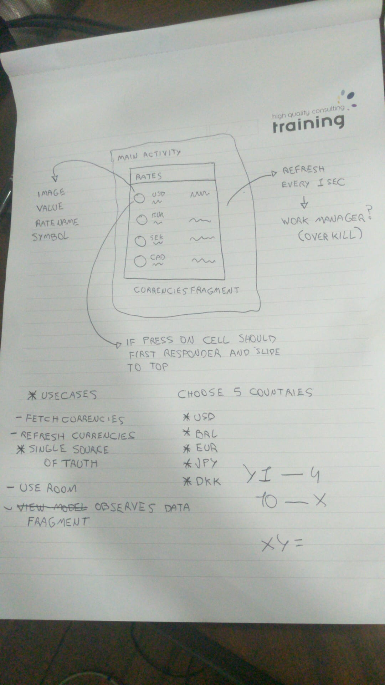

# About
This application shows a list of currencies consumed from API

# Offline
This application works without internet, providing the correct values.

# Project structure
Explore the project master branch and packages to see how it works. The project architecture is MVVM/MVI with Clean Architecture using SOLID concepts.

# UI

### Overview
The `app` module is the main entry.

### Tests
Unit and Automated tests are implemented.

# Sketch Planning

### Features organization

I have organized my code by feature. This avoid to share knowledge between feature without is required.

- **Reviews Screen**
  * Show Currencies
  * Refresh currencies every 1 second
  * When tap  currency should slide to the top
  * Currency calculate

# WARNING

- Automated tests works only API 26 or greater.
- Disabled animation.
